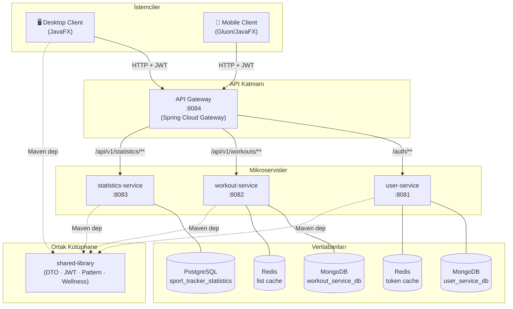
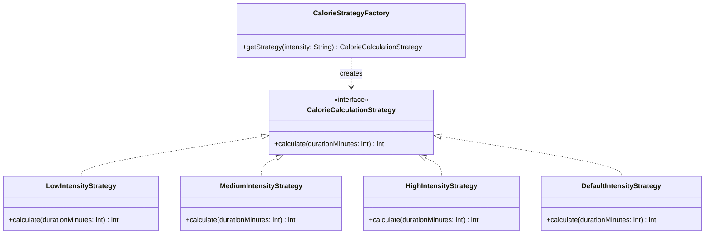
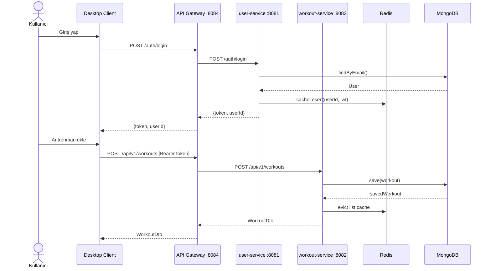
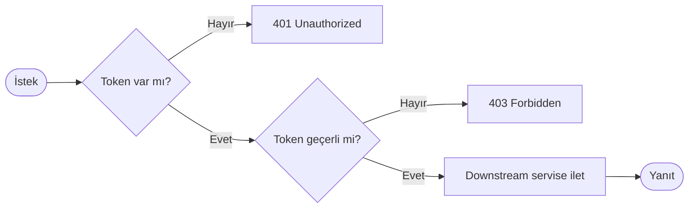
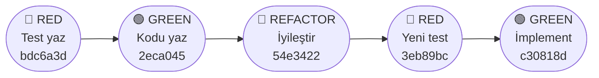
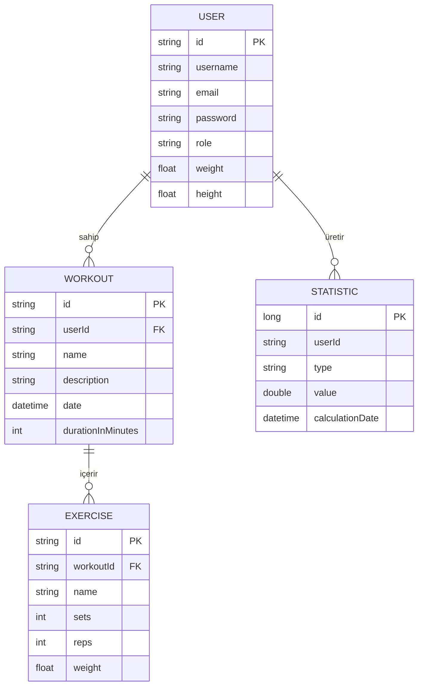

# Mimari Dokümantasyon

## Genel Sistem Mimarisi



## Servis Sorumlulukları

### api-gateway (:8084)
Spring Cloud Gateway tabanlı yönlendirici. Gelen istekleri path'e göre ilgili servise iletir:
- `/auth/**` → user-service
- `/api/v1/workouts/**` → workout-service
- `/api/v1/statistics/**` → statistics-service

### user-service (:8081)
Kullanıcı kimlik doğrulama ve profil yönetimi.
- **MongoDB**: Kullanıcı verileri (`user_service_db`)
- **Redis**: JWT token önbellekleme ve oturum yönetimi
- **JWT**: `shared-library`'deki `JwtTokenProvider` ile token üretimi/doğrulaması

### workout-service (:8082)
Antrenman verilerinin CRUD yönetimi.
- **MongoDB**: Antrenman dokümanları (`workout_service_db`)
- **Redis**: Sık erişilen antrenman listelerinin önbelleklenmesi
- Egzersiz listesi gömülü doküman olarak saklanır

### statistics-service (:8083)
Kullanıcı performans istatistikleri.
- **PostgreSQL**: İlişkisel istatistik verileri (`sport_tracker_statistics`)
- Workout-service'ten beslenen agregat sorgular

### shared-library
Tüm servislerin ortak bağımlılığı. Maven `install` ile yerel repoya yüklenir.
- DTOs: `UserDto`, `WorkoutDto`, `ExerciseDto`
- Güvenlik: `JwtTokenProvider`, `JwtUtil`, `JwtProperties`
- Pattern: `CalorieStrategyFactory` + Strategy uygulamaları
- Wellness: `WellnessStore`, `HabitEngine`, `ChallengeEngine`, `AdaptiveGoalEngine`, `SmartReminderService` ve 20+ sınıf
- Util: `AuthValidator`, `CalorieCalculator`

## Tasarım Kalıpları

### Factory Kalıbı



Masaüstü istemcide `WorkoutModalController` canlı kalori tahmini için kullanır.

### Strategy Kalıbı
```java
public interface CalorieCalculationStrategy {
    int calculate(int durationMinutes);
}
```
Her strateji farklı MET katsayısıyla kalori hesaplar. Yeni şiddet türü eklemek için sadece yeni bir strateji sınıfı + factory kaydı yeterlidir; mevcut kod değişmez.

## Veri Akışı (Sequence)



## Güvenlik Modeli



1. Kullanıcı `/auth/login` ile JWT alır
2. Tüm korumalı endpoint'ler `Authorization: Bearer <token>` header bekler
3. API Gateway token'ı doğrular, geçerliyse downstream servise iletir
4. Token süresi dolduğunda yeniden login gerekir

## TDD Döngüsü



Her servis için Red→Green→Refactor döngüsü commit geçmişinde tarih damgasıyla kanıtlanmıştır.

## Veritabanı Şemaları



Başlangıç scriptleri:
- `database/mongodb/` — MongoDB koleksiyon ve index tanımları
- `database/postgres/` — PostgreSQL tablo şemaları

## Desktop Client Mimarisi

JavaFX tabanlı masaüstü istemcisi MVC mimarisini izler:
- **Model**: `dto/` paketindeki DTO sınıfları + `shared-library` DTO'ları
- **View**: `resources/fxml/` — dashboard, login, register, profile, workout modal, workout detail
- **Controller**: `controller/` — her FXML için ayrı controller
- **Service**: `api/ApiClient.java` — HTTP istemcisi (HttpClient + Jackson)

### Wellness Modülü (Desktop)
`DashboardController` `WellnessSections` aracılığıyla `shared-library`'deki tüm wellness motorlarına erişir:
- Alışkanlık takibi (HabitEngine)
- Zorluk kartları (ChallengeEngine)
- Adaptif hedefler (AdaptiveGoalEngine)
- Akıllı hatırlatıcılar (SmartReminderService)
- Nabız zonu analizi (HeartRateZoneCalculator)
- Öğün takibi (MealAggregator)
